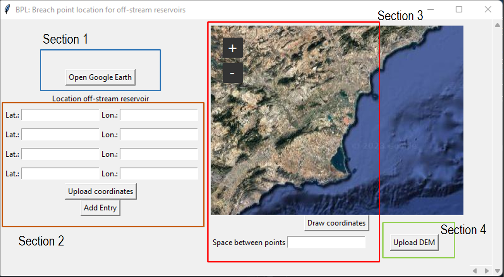
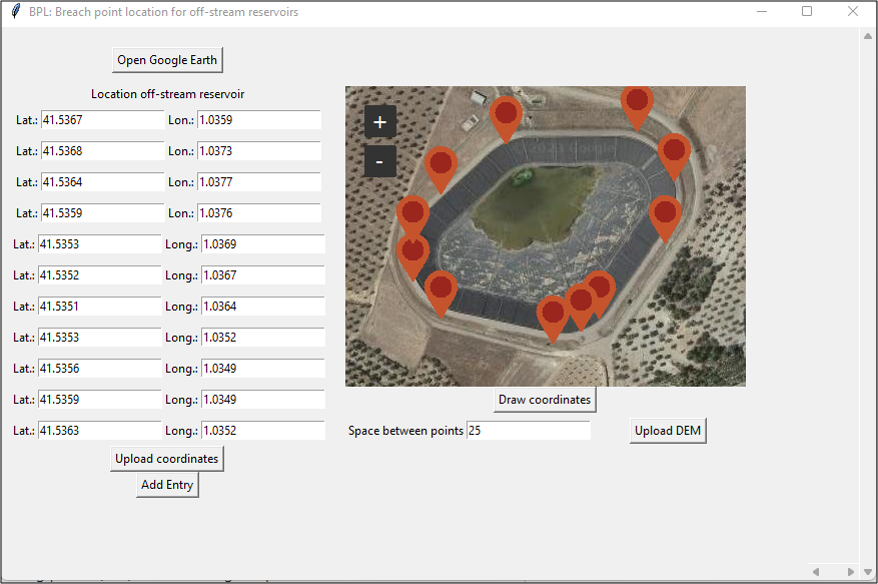
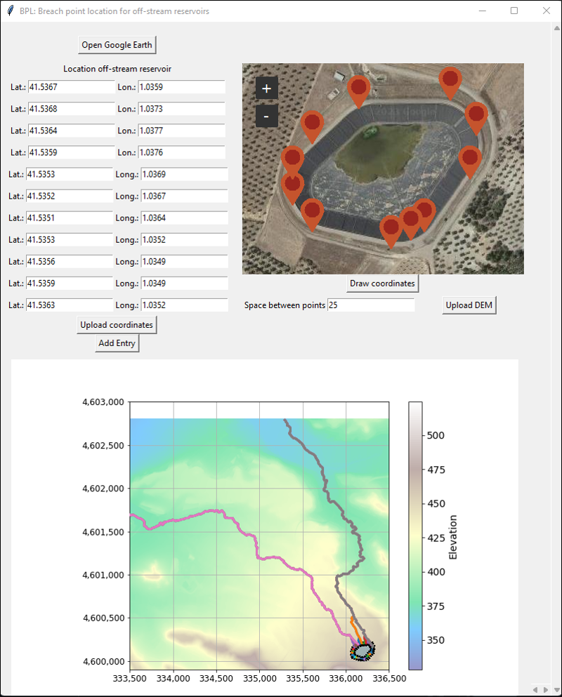

# BPL: Breaking point location for off-stream reservoirs
This tool enables reservoir owners and administrators to evaluate the most probable discharge pathways resulting from a reservoir failure. It provides a means for assessing potential scenarios and understanding the likely routes through which the reservoir water would flow in the event of a failure.

The tool evaluates the flow path from several breaking points (BPs) located along the perimeter of the reservoir. The separation between the BPs is determined by the user.

## Dependencies
It is recommended to use Anaconda to install the dependencies:

-[Python 3.8](https://www.python.org/downloads/release/python-380/)

-[pyproj 3.4.1](https://pyproj4.github.io/pyproj/stable/)

-[tkintermapview 1.17](https://github.com/TomSchimansky/TkinterMapView)

-[tkinter 3.17](https://docs.python.org/3/library/tkinter.html)

-[pysheds 0.2.7](https://pypi.org/project/pysheds/)

-[rasterio 1.3.4](https://pypi.org/project/rasterio/)   

-[matplotlib 3.6.2](https://matplotlib.org/stable/index.html)

 ## Installation  
Download the script Interface_location.py. Execute the Python file from the Python console or any other console, such as Spyder.

## Manual

The main window of BPL is divided into four sections. Section 1 features a button that opens a Google Earth window, enabling users to search for the coordinates of their off-stream reservoir. Once the user obtains the coordinates representing the reservoir's perimeter, they can enter the values manually or upload them as a CSV file using the "Upload Coordinates" button in Section 2. 
BPL requires a minimum of four coordinates to outline the perimeter of the reservoir. However, if the shape of the structure requires additional points, it is also possible to add more pairs of coordinates.

Section 3 of the application displays a map with the plotted coordinates. Users can then input the desired spacing between breaking points for analysis. In Section 4, users are prompted to upload a Digital Elevation Model (DEM) of the area. For better performance, it is recommended not to upload excessively large files.

After the DEM is uploaded, BPL identifies the flow paths from each breaking point. Once the process is complete, a plot showcasing the potential flow paths is displayed at the bottom.

## Support
For support, email me at nsilva@cimne.upc.edu
